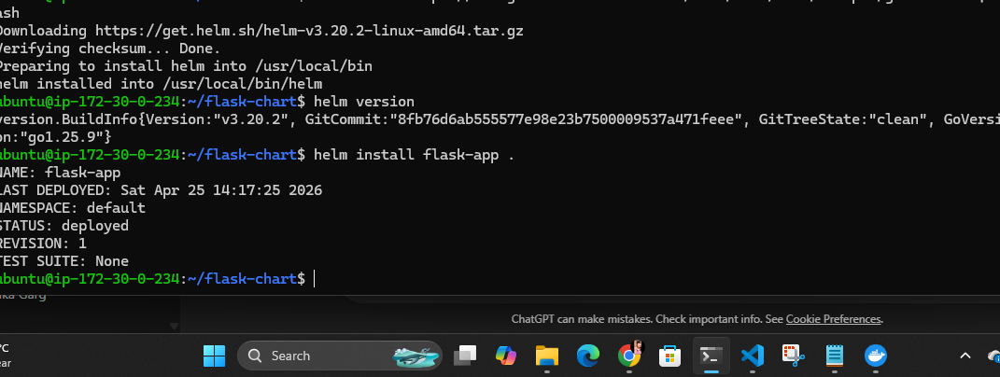

# Flask User Management App

A simple Flask + MySQL application to add and delete users, containerized using Docker and deployable on Kubernetes/EKS using Helm.

---

## 🚀 Features

- Add users
- Delete users
- Flask backend
- MySQL database (AWS RDS)
- Docker support
- Kubernetes + Helm deployment support

---

## 🛠️ Prerequisites

- Docker
- Python 3
- AWS RDS MySQL database
- (Optional) Kubernetes / EKS / Helm

---

# 📦 Run Locally Using Docker

## 1️⃣ Clone Repository

```bash
git clone <your-repo-url>
cd <repo-name>


Create .env File

Create a .env file in the project root:

DB_HOST=<your-rds-endpoint>
DB_USER=<your-db-username>
DB_PASS=<your-db-password>
DB_NAME=mydb


Create Database in AWS RDS

Create a MySQL database in AWS RDS and create the required table:

CREATE DATABASE mydb;

USE mydb;

CREATE TABLE users (
    id INT AUTO_INCREMENT PRIMARY KEY,
    name VARCHAR(255) NOT NULL
);


Build Docker Image
docker build -t flask-user-app .

Run Docker Container
docker run --env-file .env -p 5050:5050 flask-user-app
Access Application

Open in browser:

http://localhost:5050


Deploy on Kubernetes / EKS
Install Helm Chart
helm install flask-app .


Screenshots
EKS Cluster Deployment

Helm Chart Deployment
 


Tech Stack
Flask
MySQL
AWS RDS
Docker
Kubernetes
Helm
AWS EKS